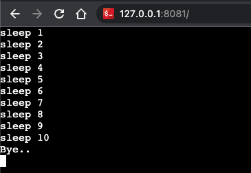

# CLIPTY
> Transform your Command Line Interface (CLI) function into a web browser-based terminal emulator.

## Preview


## Usage
1. 
    ```bash
    go get github.com/byebyebruce/clipty
    go get github.com/sorenisanerd/gotty/server
    ```
2.
    ```go

    func main() {
        ctx, cancel := context.WithCancel(context.Background())
        defer cancel()

        opt := &server.Options{}
        err := clipty.RunServer(ctx, opt, nil, func(ctx context.Context, params map[string][]string, stdin *os.File, stdout *os.File, stderr *os.File) {
                for i := 0; i < 10; i++ {
                    select {
                    case <-ctx.Done():
                        return
                    default:
                    }
                    time.Sleep(time.Second)
                    fmt.Fprintln(stdout, "sleep", i+1)
                }
                fmt.Fprintln(stdout, "Bye..")
            })
        if err != nil {
            log.Fatal(err)
        }
    }
    ```
3. 
    ```bash
    go run .
    ```
4. open http://localhost:8081
## Example
[example](example)


## SPECIAL THANKS
* [GoTTY](https://github.com/sorenisanerd/gotty)


